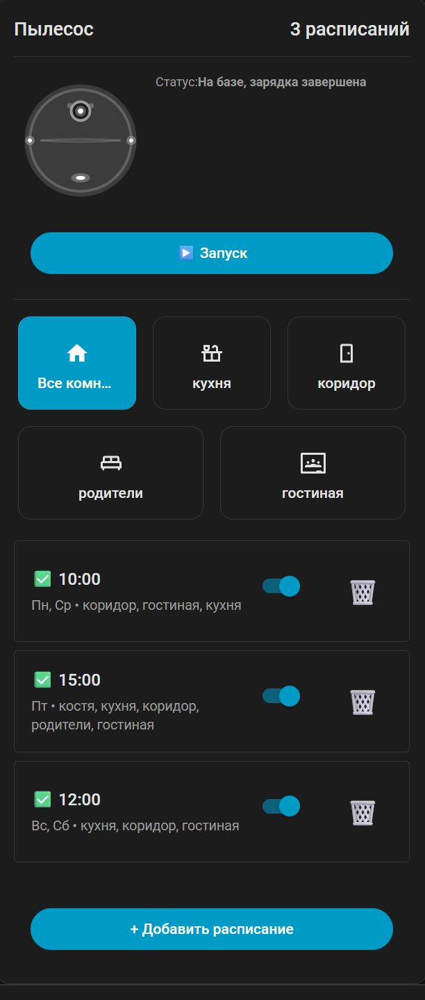

# Vacuum Schedule Card

A custom Home Assistant Lovelace card for creating and managing vacuum cleaning schedules for robot vacuums (including Dreame, Xiaomi M30S, and others) using the [dreame-vacuum](https://github.com/Tasshack/dreame-vacuum) integration.

**Languages:** [English](README.md) | [Русский](README.ru.md)



## Features

- ✅ **Vacuum Control Panel** - Direct vacuum control from the card (start, stop, pause, return to base)
- ✅ **Room Selection** - Select specific rooms or clean the entire house directly from the control panel
- ✅ **Vacuum Robot Icon** - Visual status indication with a Xiaomi-style icon
- ✅ Create and manage cleaning schedules
- ✅ Select days of the week for each schedule
- ✅ Set cleaning time
- ✅ Select rooms for cleaning in schedules (or clean all rooms)
- ✅ Enable/disable schedules with one click
- ✅ Edit and delete schedules
- ✅ Automatic creation and synchronization of Home Assistant automations
- ✅ Instant display of changes (dialog closes immediately, automations are created in the background)
- ✅ Automatic reload of automations after changes
- ✅ Localization support (Russian and English)
- ✅ Full Home Assistant theme support
- ✅ Touch-screen optimized design
- ✅ Custom card title

## Installation

### Via HACS (Recommended)

1. Make sure you have [HACS](https://hacs.xyz/) installed
2. In HACS, go to "Frontend"
3. Click the three dots in the top right corner → "Settings" → "Custom repositories"
4. Add the repository:
   - URL: `https://github.com/drrhaos/vacuum-schedule-card`
   - Category: "Lovelace"
5. Find "Vacuum Schedule Card" in HACS and install it
6. Restart Home Assistant

**Installing from Latest Commits:**

HACS automatically uses the latest commit from the `main` branch for Lovelace cards if the compiled file is available in the repository.

**How it works:**
1. On each commit to the `main` branch, a GitHub Actions workflow automatically runs
2. The workflow builds the project and commits the `dist/vacuum-schedule-card.js` file to the `main` branch
3. HACS automatically sees this file and uses it for installation/updates

**To install from latest commits:**
- Simply install the card via HACS - it will automatically use the latest commit from `main`
- When updating the card, HACS will also use the latest commit

**If HACS only shows releases:**
- Make sure the `dist/vacuum-schedule-card.js` file is present in the `main` branch of the repository
- Check that the `build-and-commit.yml` workflow runs successfully and commits the file
- Try reinstalling the card via HACS (three dots → Uninstall, then Install again)

**Note:** The `dist/vacuum-schedule-card.js` file is automatically built and committed to the `main` branch on each source code change via the GitHub Actions workflow `build-and-commit.yml`.

### Manual Installation

1. Download the `vacuum-schedule-card.js` file from releases (located in the `dist/` folder)
2. Copy it to the `www` folder in your Home Assistant configuration directory
3. Add the resource in Home Assistant:
   - Go to "Settings" → "Dashboards" → "Lovelace" → "Resources"
   - Click "Add Resource"
   - URL: `/local/vacuum-schedule-card.js`
   - Type: "JavaScript Module"
4. Restart Home Assistant

## Usage

### Adding the Card to Dashboard

1. Go to Lovelace dashboard edit mode
2. Click "Add Card"
3. Select "Manual Configuration"
4. Add the following configuration:

```yaml
type: custom:vacuum-schedule-card
entity: vacuum.your_vacuum_entity
title: "Vacuum Schedule"  # Optional: custom card title
hidden_rooms: [16, 17]  # Optional: list of room IDs to hide from selection
show_room_ids: false  # Optional: show room IDs on buttons
room_icons:  # Optional: custom icons for rooms
  16: "🛋️"
  17: "🛏️"
  18: "🍳"
```

Replace `vacuum.your_vacuum_entity` with your vacuum's entity ID (e.g., `vacuum.xiaomi_m30s`).

### Configuration Parameters

- **`entity`** (required) - Vacuum entity ID (e.g., `vacuum.xiaomi_m30s`)
- **`title`** (optional) - Custom card title. If not specified, the default title from translations is used
- **`hidden_rooms`** (optional) - Array of room IDs to hide from selection (e.g., `[16, 17]`). Hidden rooms will not appear in the control panel or in the schedule creation/editing dialog
- **`show_room_ids`** (optional, default `false`) - Show room IDs on room selection buttons
- **`room_icons`** (optional) - Dictionary of custom icons for rooms by their ID. Format: `{ "16": "🛋️", "17": "🛏️" }`

### Control Panel

The top of the card contains a vacuum control panel:

- **Control Buttons:**
  - ▶️ **Start** - Starts cleaning (entire house or selected rooms)
  - ⏹️ **Stop** - Stops current cleaning
  - ⏸️ **Pause** - Pauses cleaning
  - 🏠 **Return to Base** - Returns vacuum to charging dock

- **Room Selection:**
  - "All rooms" button - for cleaning the entire house
  - Individual room buttons - for selective cleaning
  - Buttons can be toggled (select multiple rooms)
  - When rooms are selected, cleaning will only run for selected rooms
  - Specific rooms can be hidden from selection by specifying their IDs in the `hidden_rooms` parameter

**Note:** Control buttons automatically hide when they are inactive (e.g., the "Start" button is hidden during cleaning).

### Creating a Schedule

1. Click the "Add" button on the card
2. Select days of the week (can select multiple)
3. Set cleaning time in HH:MM format
4. Select rooms for cleaning (can select multiple or leave empty to clean all rooms)
5. Enable or disable the schedule
6. Click "Save"

**Note:** After saving, the dialog closes immediately and the schedule appears in the list. Automations are created automatically in the background.

### Managing Schedules

- **Enable/Disable**: Use the toggle switch to the right of the schedule
- **Delete**: Click the trash icon button
- **Edit**: Click on the schedule to edit it

## Room Configuration

By default, the card uses the room list from your vacuum's attributes. If rooms are not defined, default names will be used:
- Living Room
- Bedroom
- Kitchen
- Bathroom

### Getting Room IDs

To get the correct room IDs for your vacuum:

1. Open Developer Tools in Home Assistant
2. Go to the "Services" tab
3. Select the `dreame_vacuum.get_room_mapping` service
4. Specify your vacuum's `entity_id`
5. Call the service
6. Check the result in logs or notifications

### Custom Room Icons

You can set custom icons for rooms in the card configuration:

```yaml
type: custom:vacuum-schedule-card
entity: vacuum.xiaomi_m30s
room_icons:
  16: "🛋️"  # Living Room
  17: "🛏️"  # Bedroom
  18: "🍳"  # Kitchen
  19: "🚿"  # Bathroom
```

### Displaying Room IDs

For debugging, you can enable displaying room IDs on buttons:

```yaml
type: custom:vacuum-schedule-card
entity: vacuum.xiaomi_m30s
show_room_ids: true
```

### Hiding Specific Rooms

You can hide specific rooms from selection by specifying their IDs in the `hidden_rooms` parameter. Hidden rooms will not appear in the control panel or in the schedule creation/editing dialog:

```yaml
type: custom:vacuum-schedule-card
entity: vacuum.xiaomi_m30s
hidden_rooms: [16, 17]  # Hide rooms with IDs 16 and 17
```

**Note:** If hidden rooms were selected in an existing schedule, they will remain in the schedule but will not be displayed in the interface. When editing a schedule, hidden rooms will be automatically removed from the selection.

## Automations

The card automatically creates and manages Home Assistant automations for each schedule.

### Automation Format

Automations are created with IDs in the format:
- `vacuum_schedule_{schedule_id}_day_{day}`

Where:
- `schedule_id` - unique schedule identifier
- `day` - day of week number (0-6, where 0 = Sunday, 1 = Monday, etc.)

### Automation Structure

Each automation contains:
- **Trigger**: Cleaning time (e.g., `09:00:00`)
- **Condition**: Day of week (e.g., `mon` for Monday)
- **Action**: Call to `dreame_vacuum.vacuum_clean_segment` service with specified rooms

### Automatic Synchronization

- Automations are automatically reloaded after creating, updating, or deleting a schedule
- When a schedule is changed, old automations are deleted and new ones are created
- When a schedule is disabled, all related automations are deleted
- When a schedule is enabled, automations are recreated

## Localization

The card automatically detects the Home Assistant interface language and displays text in the corresponding language. The following languages are supported:

- **English** (en) - default language for all languages
- **Russian** (ru) - automatically detected for languages starting with "ru"

The language is determined from Home Assistant settings (`hass.locale.language` or `hass.language`). If the language is not defined or not supported, English is used.

## Requirements

- Home Assistant 2023.1 or newer
- [dreame-vacuum](https://github.com/Tasshack/dreame-vacuum) integration by Tasshack
- Dreame robot vacuum (Xiaomi M30S and other models)

## Development

### Building from Source

1. Install dependencies:
```bash
npm install
```

2. Build the project:
```bash
npm run build
```

3. For development with automatic rebuild:
```bash
npm run watch
```

### Project Structure

```
.
├── dist/
│   └── vacuum-schedule-card.js  # Compiled file
├── src/
│   ├── vacuum-schedule-card.ts  # Main card component
│   ├── types.ts                 # TypeScript types and interfaces
│   ├── constants.ts             # Constants
│   ├── components/              # UI components
│   │   ├── control-panel.ts     # Vacuum control panel
│   │   ├── schedule-list.ts     # Schedule list
│   │   └── schedule-dialog.ts   # Schedule editing dialog
│   ├── services/                # Business logic
│   │   ├── vacuum.service.ts    # Vacuum control
│   │   └── schedule.service.ts  # Schedule management
│   ├── utils/                   # Utilities
│   │   ├── automations.ts       # Automation handling
│   │   ├── api.ts               # API requests
│   │   ├── rooms.ts             # Room loading
│   │   ├── formatters.ts        # Data formatting
│   │   ├── i18n.ts              # Internationalization
│   │   ├── event-subscription.ts # Event subscription utilities
│   │   └── svg-loader.ts        # SVG icon loading
│   ├── translations/            # Translations
│   │   ├── en.ts                # English translations
│   │   ├── ru.ts                # Russian translations
│   │   └── index.ts             # Centralized export
│   ├── types/                   # Type definitions
│   │   └── automation.ts        # Automation types
│   └── assets/                  # Resources
│       ├── vacuum-robot.svg     # Vacuum robot icon
│       ├── vacuum-robot-outline.svg
│       └── vacuum-robot-filled.svg
├── images/                      # Screenshots
│   └── screen1.jpg
├── package.json                 # Project dependencies
├── tsconfig.json                # TypeScript configuration
├── rollup.config.mjs            # Build configuration (Rollup)
├── hacs.json                    # HACS configuration
├── LICENSE                      # License
├── CHANGELOG.md                 # Changelog
└── README.md                    # Documentation
```

### Technologies

- **TypeScript** - Typed JavaScript
- **Lit** - Library for creating web components
- **Rollup** - Module bundler
- **Home Assistant WebSocket API** - For interacting with Home Assistant
- **Home Assistant REST API** - For managing automations
- **CSS Variables** - Full Home Assistant theme support
- **Component-based Architecture** - Modular architecture with separation into components and services

## Troubleshooting

### Card Not Displaying

1. Make sure the resource is added to Lovelace (Settings → Dashboards → Lovelace → Resources)
2. Restart Home Assistant
3. Check the browser console (F12) for errors

### Schedules Not Saving

1. Check Home Assistant logs for errors
2. Make sure the dreame-vacuum integration is installed and working
3. Verify that the vacuum entity_id is correctly specified in the card configuration
4. Check the browser console (F12) - errors are displayed with the prefix `[Vacuum Schedule Card]`

### Automations Not Creating

1. Check access permissions - the card must have access to create automations
2. Check Home Assistant logs and browser console for errors
3. Make sure the dreame-vacuum integration is working correctly
4. Try creating an automation manually via Developer Tools

### Rooms Not Displaying

1. Make sure your vacuum supports segmented cleaning
2. Check vacuum attributes in Developer Tools → States
3. Use the `dreame_vacuum.get_room_mapping` service to get the room list

### Control Buttons Not Displaying

1. Make sure the vacuum entity_id is correctly specified
2. Check that the vacuum is connected and available in Home Assistant
3. Buttons automatically hide when they are inactive (this is normal behavior)
4. Check the vacuum status in Developer Tools → States

## Support

If you encounter problems or have questions:

1. Check the "Troubleshooting" section above
2. Check Home Assistant logs and browser console for errors
3. Create an issue in the project repository with a description of the problem

## License

MIT

## Acknowledgments

- [Tasshack](https://github.com/Tasshack) for the dreame-vacuum integration
- Home Assistant community for support
